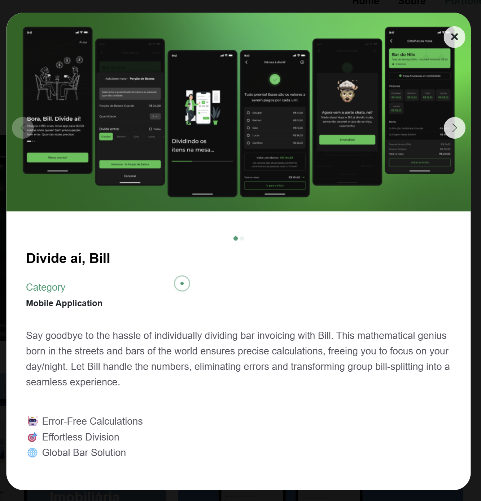

# Divide Aí, Bill 🍻

> Chega de confusão na hora de dividir a conta do bar: o Bill divide item por item, soma couvert e taxa de serviço, e mostra quanto cada um paga.

🌐 **Site:** [divideaibill.com.br](https://divideaibill.com.br)

📱 **Baixe agora:** [App Store](https://apps.apple.com/br/app/id1664642166) · [Google Play](https://play.google.com/store/apps/details?id=br.com.divideaibill)

## Telas do app

  

  

## O problema

Dividir conta de bar no "vamos rachar igual" gera injustiça, e dividir na calculadora gera briga. Couvert, taxa de serviço e quem pediu o quê viram um caos no fim da noite.

## A solução

O Bill, um gênio da matemática nascido nos bares, cuida dos números: você cria a mesa, adiciona as pessoas e os itens, marca quem consumiu o quê, e ele calcula tudo na hora, incluindo couvert e taxa de serviço.

## Funcionalidades

- **Divisão item por item**: cada um paga exatamente o que consumiu
- **Couvert e taxa de serviço** somados automaticamente
- **Mesas salvas**: histórico dos rolês com valores e datas
- **Tema claro e escuro**
- **Publicado nas lojas**: iOS e Android

## Meu papel

Pensei o conceito do produto do zero: como ele funcionaria, a jornada de dividir a conta e a experiência de uso. Também fiz a validação de mercado e da ideia antes de tirar do papel.

## Stack

`Mobile` `iOS` `Android`

## Status

✅ Publicado na App Store e no Google Play.

> 🔒 Este repositório é a vitrine do produto. O código-fonte é privado.

---

Feito por [Caio Cruz](https://github.com/CaiioFe) · [iacaio.com.br](https://iacaio.com.br)

